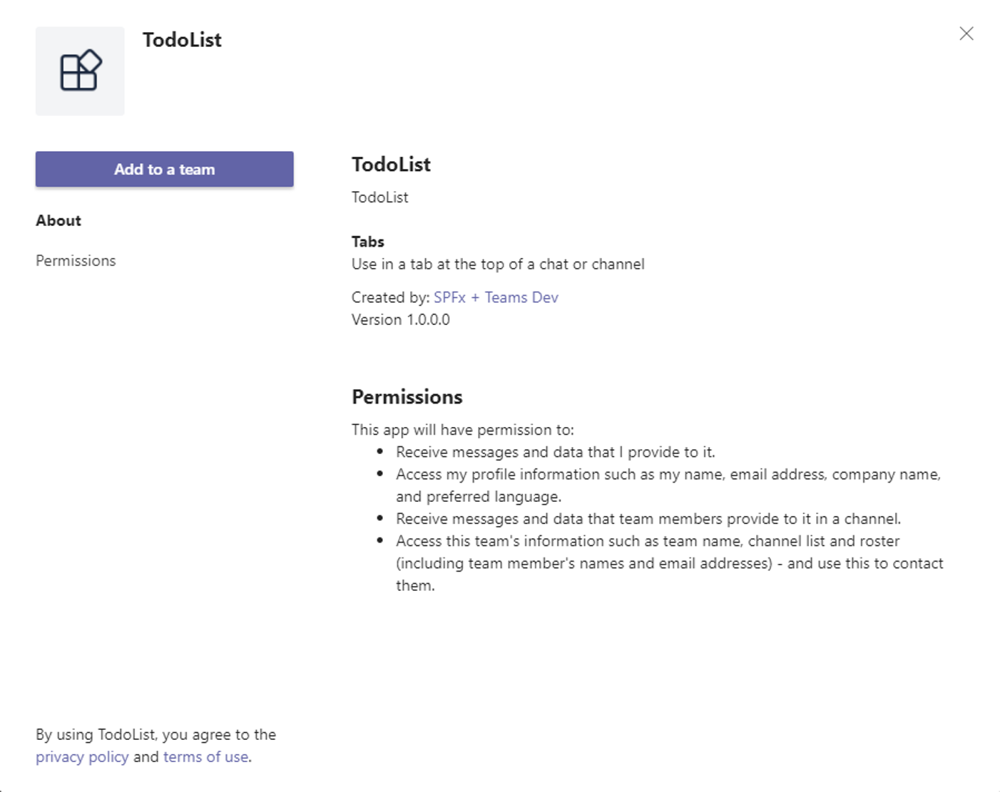

## Try sample with TeamsFx CLI
1. Install [Node.js](https://nodejs.org/en/download/) (use the latest v14 LTS release)
1. To install the TeamsFx CLI, use the npm package manager:
    ```
    npm install -g @microsoft/teamsfx-cli
    ```
1. Create todo-list-SPFx project.
    ```
    teamsfx new template todo-list-SPFx
    ```
1. Provision the project to create an app in Teams App Studio.
    ```
    teamsfx provision
    ```
1. Deploy your project (Currently only helps build the SharePoint package).
    > This step will generate a SharePoint package (*.sppkg) under `sharepoint/solution` folder.
    ```
    teamsfx deploy
    ```
1. Upload or drag-and-drop the *.sppkg file under `sharepoint/solution` folder to the SharePoint App Catalog site, follow the instruction [Deploy the HelloWorld package to App Catalog](https://docs.microsoft.com/en-us/sharepoint/dev/spfx/web-parts/get-started/serve-your-web-part-in-a-sharepoint-page#deploy-the-helloworld-package-to-app-catalog)
    > Note: Tick the "Make this solution available to all sites in the organization" option to make the solution available in Teams.
1. Publish your app to Teams App Studio.
    ```
    teamsfx publish
    ```
1. Check the published app in [Microsoft Teams admin center](https://admin.teams.microsoft.com/policies/manage-apps) by searching "todoList" in the search box.

1. Click the 'TodoList' app you just published and select `Publish` in the Publishing status.

    

    It may take a few minutes to publish the Teams app.
1. Login to Teams using your M365 tenant admin account, same account you are using to create SharePoint environment and logging to VS Code extension. You will see your app in the `Apps - Built for your org`. 

1. Add the app to your Teams.

1. You should see the app running in your Teams.
